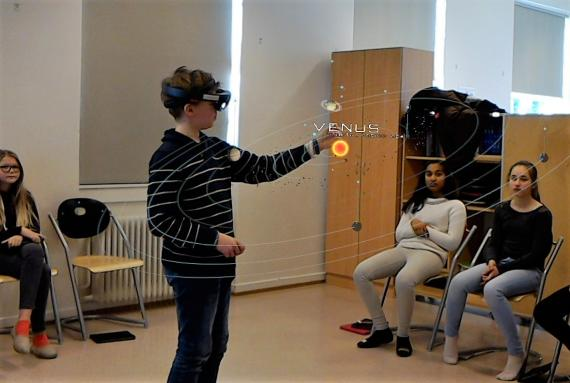
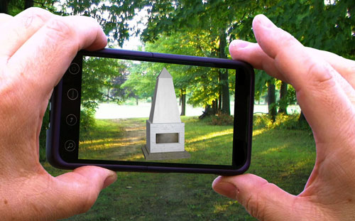

# WebXR for Learning

"WebXR for Learning" is a working title for [a project idea for Mozilla's Global Sprint](https://github.com/mozilla/global-sprint/issues/295), May 10-11, 2018. Hopefully during the Sprint we can turn this idea into a prototype!

## The Idea

Augmented Reality and Virtual Reality can help bring subjects to life, making learning more immersive and exciting! The idea for this project is to create a free, open repository of Augmented Reality and Virtual Reality content / learning experiences, aimed at educators and students. It would contain 3D assets, categorised/tagged to make them easy to find by topic/curriculum. Teachers and students could then use it to quickly find suitable content for lessons, study or revision. They could load the content directly in their web browser, remix it, or embed it in other websites / web applications.

 

*Credits: [Pointmedia via vrfocus.com](https://www.vrfocus.com/2017/03/hololens-sees-use-in-norway-classrooms/), [edudemic.com](http://www.edudemic.com/wp-content/uploads/2013/06/augmented-reality.png)*

## Demo

To try it out, you can access it at [poshaughnessy.github.io/webxr-for-learning/](https://poshaughnessy.github.io/webxr-for-learning/). 

Most web browsers should be able to display the 3D content. To view the experiences in AR or VR, 
you will need one of the [AR/VR browsers supported by aframe-xr](https://github.com/mozilla/aframe-xr#supported-browsers).

## Development

* Check out this respository from Github.
* Serve the directory using any static site server, such as `python -m SimpleHTTPServer` or `python3 -m http.server` 
  via the command line ([more info here](https://www.linuxjournal.com/content/tech-tip-really-simple-http-server-python)).
* View the website at the relevant local address, e.g. `localhost:8000` if you use the python command above.

## Technology Background

Augmented Reality (AR) and Virtual Reality (VR) are on the rise. Virtual Reality is now quite accessible with cheap cardboard-based headsets. Impressive Augmented Reality experiences are now becoming possible with just a mobile phone (for example, making use of ARKit on iOS and ARCore on Android). And both VR and AR are now possible with web technologies, most notably with the up-and-coming [WebXR standard](https://github.com/immersive-web/webxr) ("XR" incorporates both Augmented Reality and Virtual Reality, basically meaning "Whichever Kind You Want" Reality!).

Mozilla have a WebXR library called [Three.xr.js](https://github.com/mozilla/three.xr.js/) (based on the 
popular [Three.js](https://threejs.org/)), plus [aframe-xr](https://github.com/mozilla/aframe-xr) (based on [A-Frame](https://aframe.io/)) which makes it possible to develop AR and VR content on the web by writing HTML! 
This project currently uses [aframe-xr](https://github.com/mozilla/aframe-xr) for the AR/VR part of the prototype.

## To Do List

We will use the [Issues list here on Github](https://github.com/poshaughnessy/webxr-for-learning/issues) to create and manage the tasks.

Essentially over the couple of days, it would be great if we can...
 
* Ideate about how the site would work for end-users (e.g. user journey)
* Ideate about how the site would work for content creators (e.g. upload, moderation?)
* Initial wireframes and/or website design
* Create and/or find suitable, free, 3D content to incorporate
* Develop a prototype website with a few sample assets
* Make it possible to view the assets in Augmented Reality
* (If time), make it possible to view the assets in Virtual Reality too

## What Kind of Help Would Be Useful?

Any of the following kinds of skills/experience would be especially useful:

* Education / pedagogy
* Web design
* Web development (HTML / CSS / JavaScript)
* Product management
* Augmented Reality / Virtual Reality
* 3D modelling / animation

(This is not an exclusive list - other assistance would be welcome!)

## FAQ

### What about [Sketchfab](https://sketchfab.com/), [Google Poly](https://poly.google.com/) etc.?

[SketchFab](https://sketchfab.com/) and [Poly](https://poly.google.com) a great collections of 
user-submitted 3D content! However, they are not aimed at education; they are general 3D repositories 
and the content may not be suitable/relevant for educational use.

Furthermore, the idea for this project is to try creating something as free and open as possible. Imagine 
something a bit more like "Wikimedia for XR"!

We hope to make use of some of these other repositories of content though, in order to source suitable
Creative Commons content.
